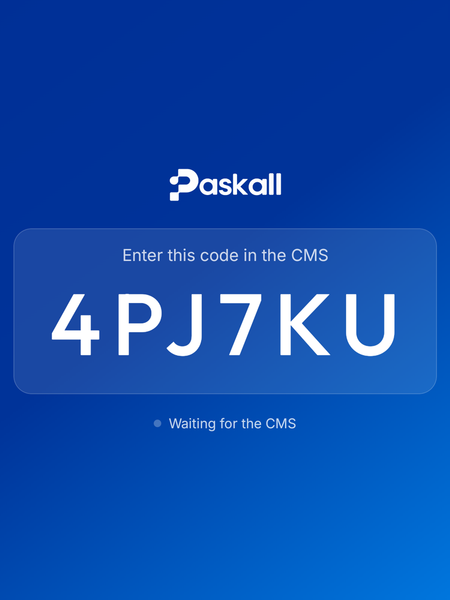
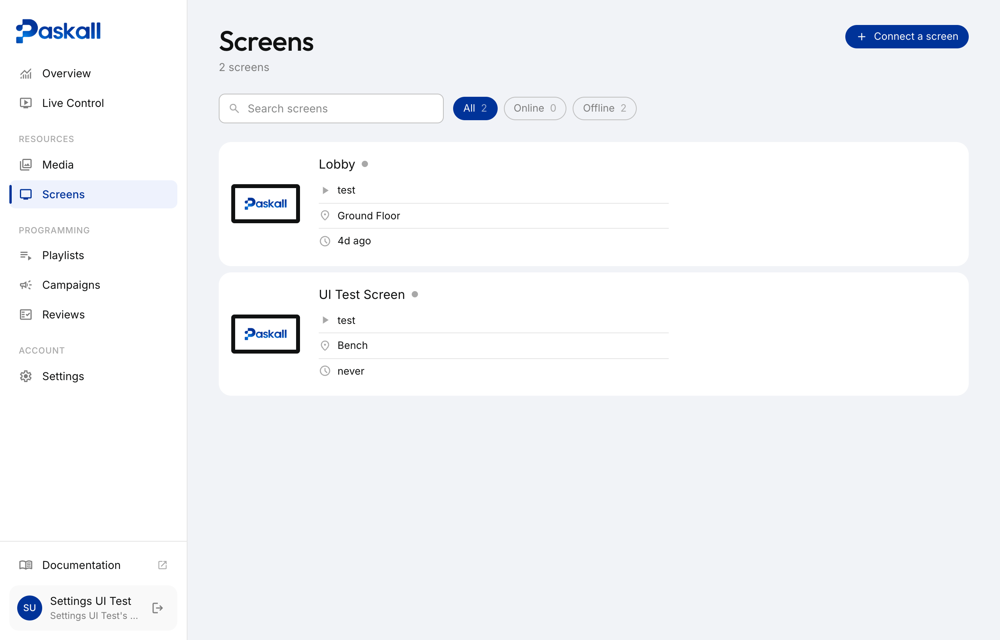
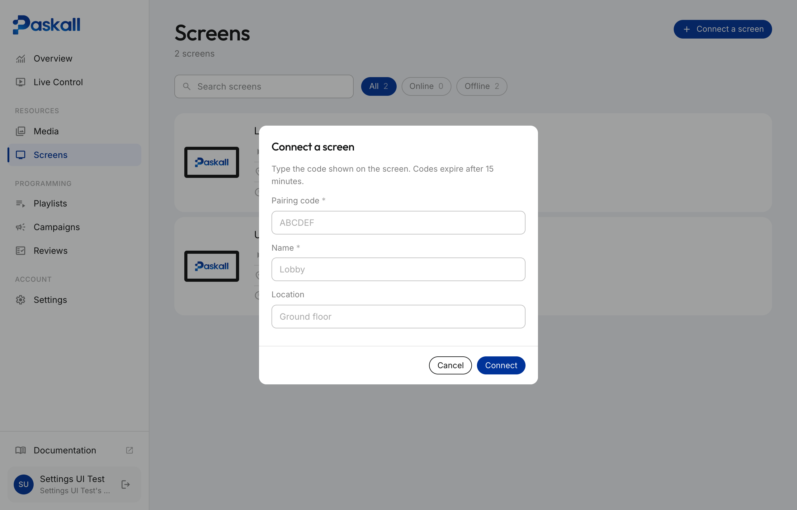
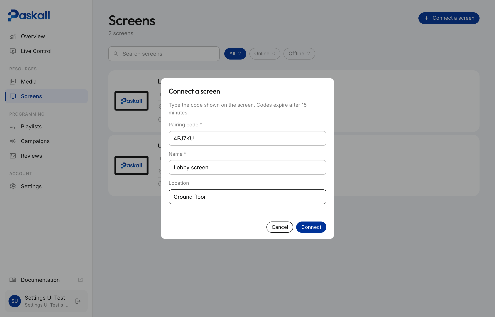
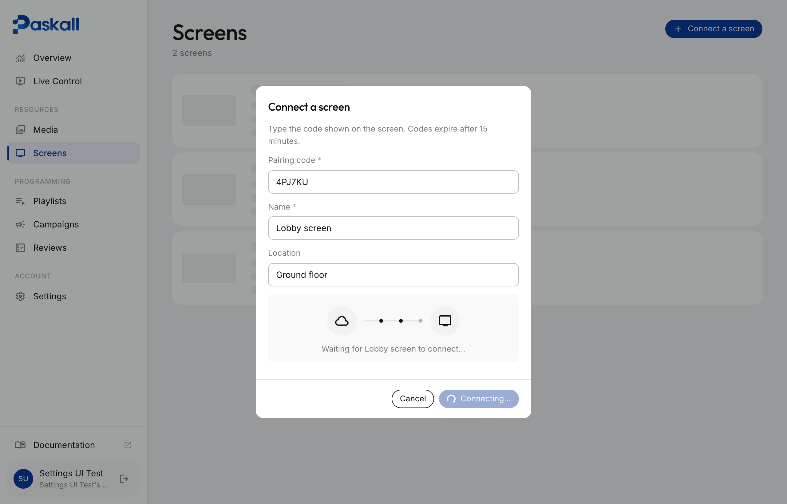
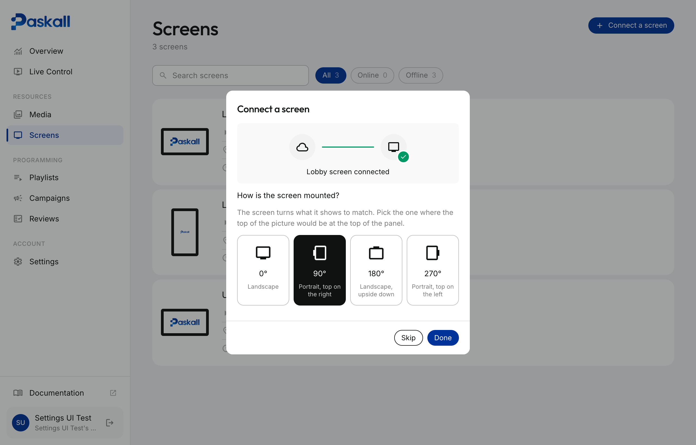
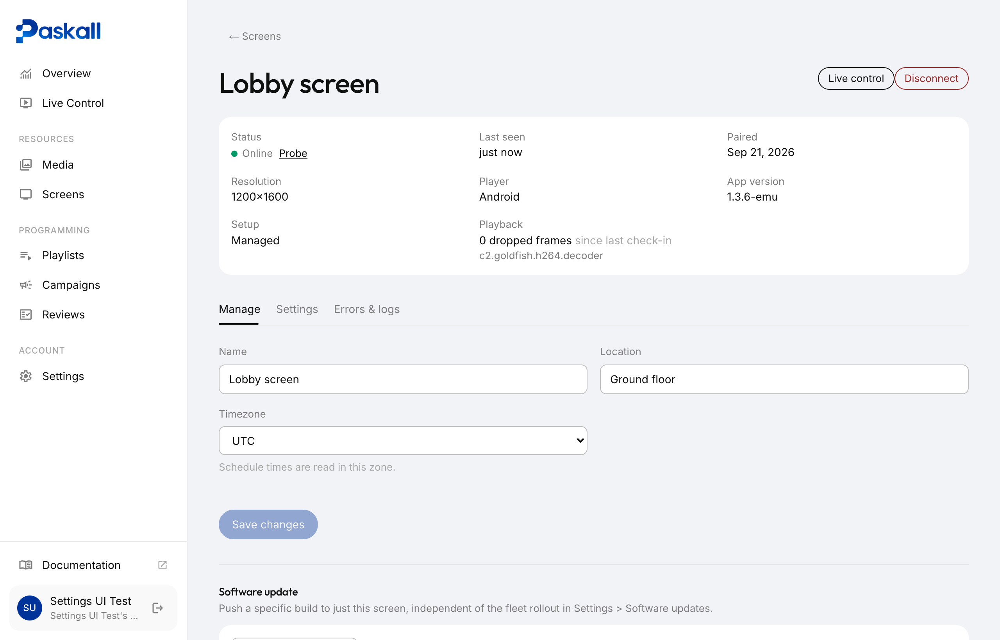

# Connecting a Screen

Connecting a screen takes about a minute: the screen shows a code, you type that code into Paskall, and the screen starts playing. This page walks through it with pictures.

## Before you start

You need two things ready. Do each once.

### 1. Setting up the device

The screen (an Android TV, stick, or tablet) must have **Paskall Player** installed and be showing a pairing code like this:



If your screen already shows a code like this, you're ready. Skip to [Pairing a screen](#pairing-a-screen).

If the screen is new and has nothing installed yet, follow [Installing the player on a new device](#installing-the-player-on-a-new-device) at the bottom of this page first. That takes about 10 minutes and is done once per screen.

### 2. Setting up your account

*Coming soon.*

## Pairing a screen

**Step 1.** Open Paskall and go to **Screens** in the left menu. Click **Connect a screen**.



**Step 2.** A small window opens asking for the code.



**Step 3.** Type the code exactly as the screen shows it. Give the screen a name you'll recognise later (for example "Lobby screen") and, if you like, where it is.



!!! tip
    The code never contains the letters O, I or L, or the digits 0 and 1, so there is nothing to mix up. Codes stop working after 15 minutes; if yours has expired, the screen shows a new one by itself.

**Step 4.** Click **Connect**. Paskall waits for the screen to answer. This usually takes a few seconds.



**Step 5.** Once the screen has connected, Paskall asks how it is mounted. Pick the option where the top of the picture would be at the top of the panel, then click **Done**. You can change this later on the screen's page.



**Step 6.** You land on the screen's own page. The screen itself now shows a "waiting for content" card with its name.



That's it. To make it play something, put a playlist on it from **Campaigns**. The screen starts playing within a few seconds.

!!! note "If a screen is removed from Paskall"
    It notices by itself and shows a new pairing code. Nothing needs doing on the hardware. Just connect it again with the new code.

## Orientation

Orientation is chosen when the screen connects, and can be changed any time on the screen's page under **Settings**. It is the rotation in degrees, clockwise from the panel's own landscape:

| Option | Meaning |
|---|---|
| 0° | Landscape |
| 90° | Portrait, top of the picture on the right |
| 180° | Landscape, upside down |
| 270° | Portrait, top of the picture on the left |

The two portrait options matter: a tall screen stood on the other side needs the other one, or everything shows upside down. A change takes effect within a few seconds. No reinstall is needed.

## Screen status

Paskall shows whether a screen is reachable from how long ago it last checked in.

| Status | Last checked in |
|---|---|
| Online | Under 2 minutes ago |
| Slow to respond | 2 to 15 minutes ago |
| Offline | Over 15 minutes ago, or never |

To check right now, open the screen's page and click **Probe** next to its status. It asks the screen to check in immediately and waits up to 40 seconds.

## Troubleshooting

**The screen is black, with no code and no content.**
This is almost always power or hardware, not pairing. A screen that has been removed or disconnected always shows a code. Check the power connection first.

**The code doesn't work.**
Long press anywhere on the screen to open its diagnostics view. Compare the server address shown there with the Paskall you are using. If they don't match, the screen was set up for a different server.

**How do I see what a screen is doing?**
Long press anywhere on the screen. The diagnostics view shows its name, the server it talks to, the content version, cached data, and the most recent error if there is one.

## Installing the player on a new device

*About 10 minutes, once per screen.* After this, the screen shows a pairing code and you continue with [Pairing a screen](#pairing-a-screen) above.

### Step 1: Allow the app to install

Google Play Protect blocks apps that don't come from the Play Store. Turn that off once on the device.

!!! info "Skip this if"
    You are going straight to Device Owner setup (Step 4). That path installs over a cable and isn't blocked by Play Protect.

1. Open the **Google Play Store** app on the device.
2. Tap the profile icon, top right, then **Play Protect**.
3. Tap the gear icon, top right.
4. Turn off **Scan apps with Play Protect**.

### Step 2: Install the app

[Download latest APK](https://signage-cms-production.up.railway.app/player/download){ .md-button .md-button--primary }

Always the current build. Open this link on the device's own browser for Method B, or on your computer for Method A. [Looking for an older build?](https://signage-cms-production.up.railway.app/player/versions)

#### Method A: USB, from a computer

1. On the device, go to Settings → About phone and tap **Build number** 7 times.
2. Go to Settings → Developer options and turn on **USB debugging**.
3. Connect the device to your computer with a USB cable and accept the "Allow USB debugging?" prompt on the device.
4. Run:

    ```bash
    adb install -r fortu-player.apk
    ```

#### Method B: No cable

1. On the device, open this page in its browser and tap **Download latest APK** above.
2. Open the downloaded file from the notification shade or file manager.
3. Allow "Install from unknown sources" when asked.

### Step 3: Choose how locked down the screen should be

A plain install keeps the screen awake and hides the system bars, but the Home button still exits the app. Three levels, weakest first:

| Level | Setup | What it does |
|---|---|---|
| Screen pinning | None. Settings → Security → App pinning. | Stops accidental exits only. Anyone can unpin. |
| Launcher mode | Edit AndroidManifest.xml and rebuild. | The device boots straight into the player. Not for a personal device. |
| Device Owner | Step 4 below. | **Recommended.** Can't be exited. Needed for silent updates and for switching the display fully off on a schedule. |

### Step 4: Device Owner mode (recommended)

!!! warning "Before you begin"
    The device must be factory reset, with no Google account signed in. Android won't grant Device Owner otherwise, and there is no way around it.

1. Factory reset the device: Settings → System → Reset → Erase all data.
2. During setup, skip the Google account step. Skip Wi-Fi too if offered, and add it afterwards from Settings.
3. Turn on Developer options: Settings → About → tap Build number 7 times.
4. Turn on USB debugging: Settings → Developer options → USB debugging.
5. Install the app and make it Device Owner:

    ```bash
    adb install -r fortu-player.apk
    adb shell dpm set-device-owner \
      com.fortu.player/com.fortu.player.kiosk.DeviceAdminReceiver
    ```

    You should see `Success: Device owner set to package com.fortu.player`. If it says there are already accounts on the device, an account was added during setup. Factory reset and start again from step 2.

6. Open the app. It locks itself to the foreground, disables the lock screen and keeps the screen on. Nothing else to configure.
7. Pair the screen with the code it shows. See [Pairing a screen](#pairing-a-screen).
8. Check it worked: long press the screen to open diagnostics and confirm it says `device owner (full kiosk)`. In Paskall, the screen's page shows **Setup: Managed** once it has checked in. If it says **Basic**, repeat step 5.
9. Reboot once. The device comes back to the Android home screen; open Paskall Player from there and confirm it resumes.

!!! note
    Device Owner can't be removed with a command. To reuse the device for something else later, factory reset it.
