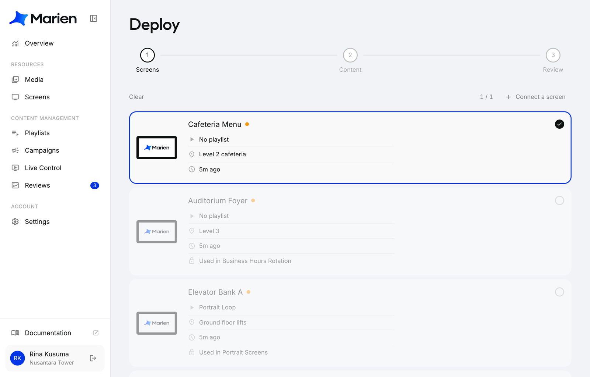
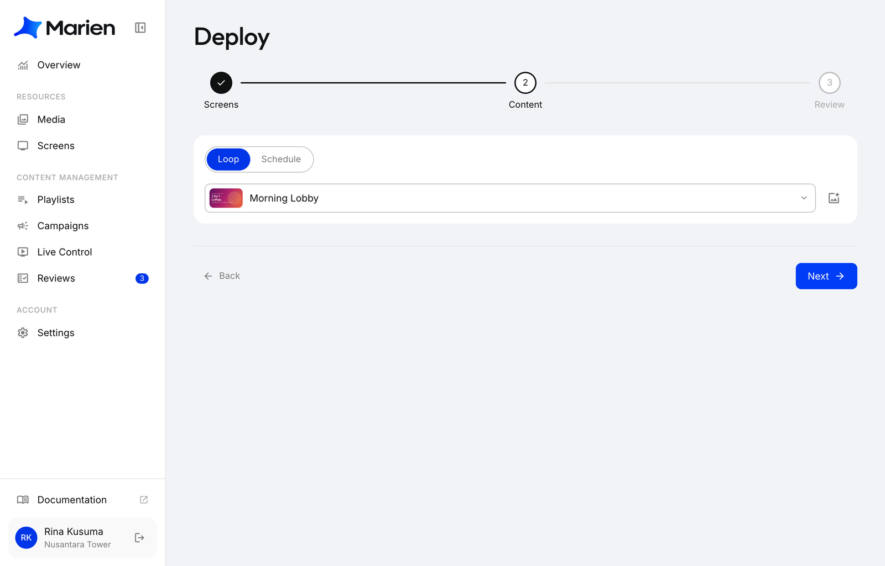
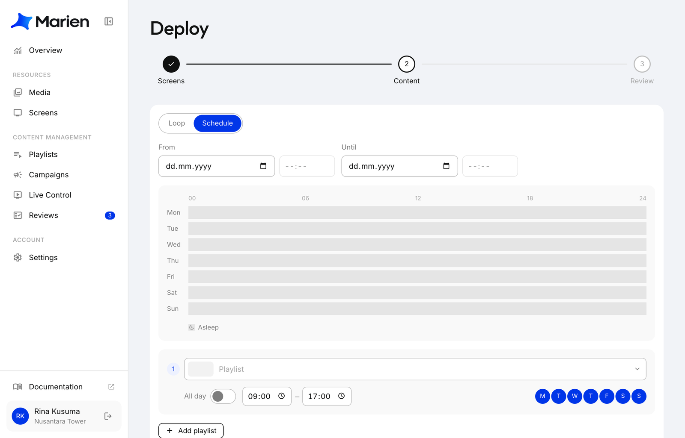
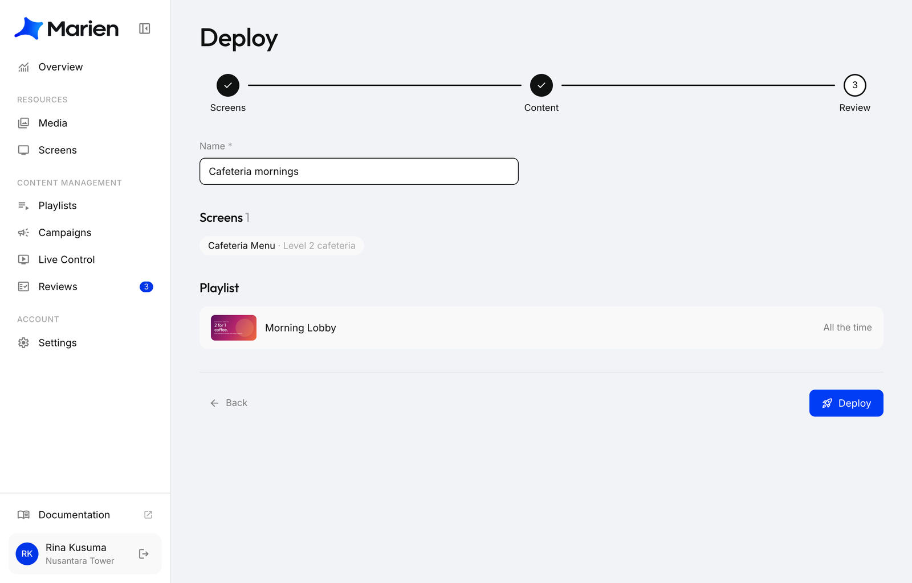

# Create a Campaign

A campaign puts playlists on screens: all the time, or on a schedule.

**1.** In Marien CMS, open **Campaigns** and click **New campaign**. Pick the screens, then click **Next**.

!!! note
    A screen can be in one campaign at a time. Greyed-out screens are already in one: change that campaign instead.

**2.** Choose what plays:

- **Loop**: pick one playlist to play all the time.
- **Schedule**: add a playlist per time slot (hours and days), with optional start and end dates.

Click **Next**.

**3.** Name the campaign, check it, and click **Deploy**, then **Deploy** again to confirm.

**4.** Done. The screens start playing within a few seconds.

To change it later, open it from **Campaigns**, edit, and click **Save & Apply**.
