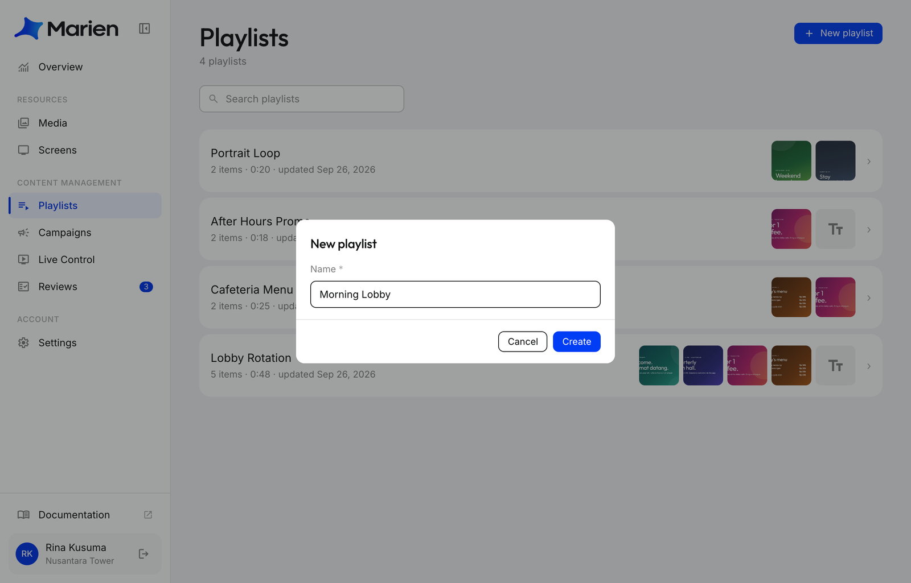
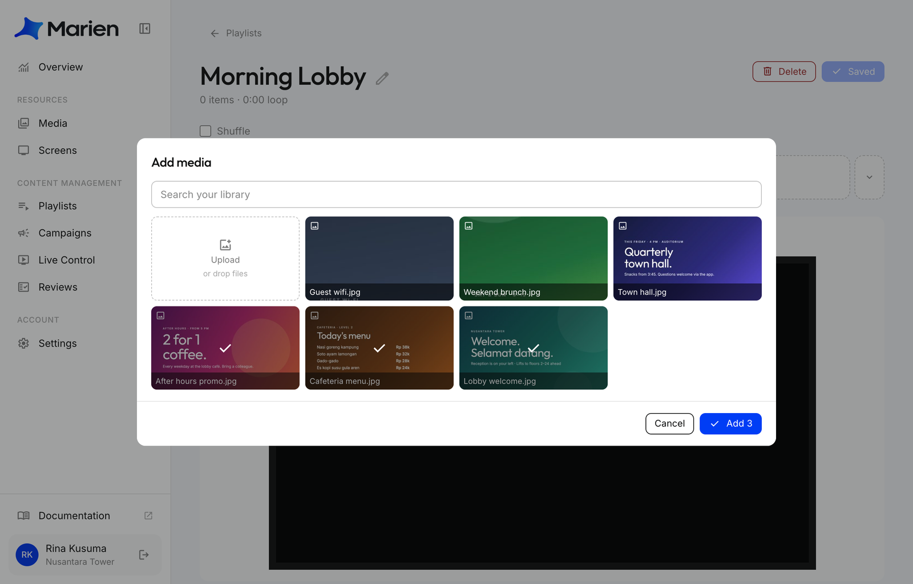
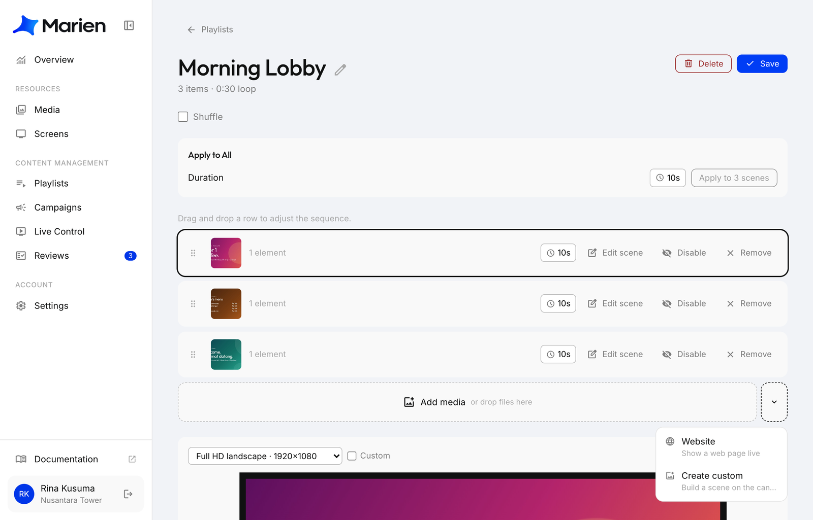

# Create a Playlist

A playlist is what a screen plays: pictures, videos, websites or your own scenes, in a loop.

**1.** In Marien CMS, open **Playlists** and click **New playlist**. Give it a name and click **Create**.

**2.** Click **Add media**, pick what to show (or **Upload** new files), and click **Add**.

**3.** Arrange it:

- Drag rows to change the order.
- Click a row's time (**10s**) to change how long it shows.
- The arrow next to **Add media** adds a **Website**, or a **custom scene** you build on the canvas.

Click **Save**.

!!! tip
    The preview at the bottom shows the playlist at your screen's shape. Pick your screen in its dropdown.

Next: [Create a Campaign](creating-a-campaign.md) to put it on a screen.
